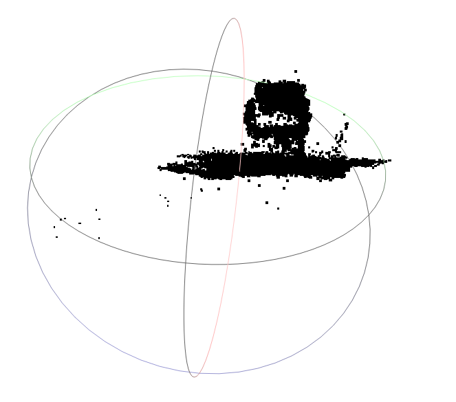

## 1. Photo processing

```
process
|-- input
    |-- 0.jpg
    |-- 1.jpg
    ...
|-- output
|-- template
    |-- template.png
```
Use the template matching method `matchTemplate` in `opencv` to intercept the `roi`.Before and after comparison is as follows：

```shell
python image.py --image_dir ./process/input --output_dir ./process/output --template ./process/template/template.jpg
```
### input

### output


## 2. Use colmap
Check out this [blog](https://zhuanlan.zhihu.com/p/576416530).


## 3. Format conversion
### Step1
```shell
python img2poses.py --scenedir ./result 
```
After running the commands above, a sparse point cloud is saved in `result/sparse_points.ply`.

### Step2
Use meshlab to define `roi`.Refer to this [blog](https://blog.csdn.net/wangzijunn/article/details/124100981).
Save it as `result/sparse_points_interest.ply`.


### Step3
```shell
python gen_cameras.py
```
Then the preprocessed data can be found in `result/preprocessed`.
**Success!**  :tada: :tada: :tada:


